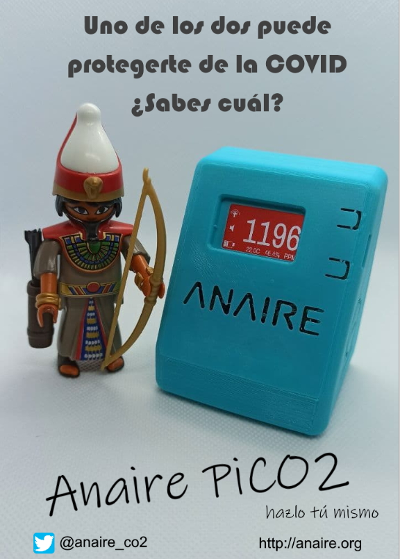

# Dispositivos ANAIRE: medidores de CO2 (NDIR), temperatura y humedad

---
**Novedad (Mayo 2021):** Nuevo medidor [ *Anaire PiCO2*](https://github.com/anaireorg/anaire-devices/blob/main/Anaire.PiCO2/README.md)
---
---

[**Anaire**](www.anaire.org) - Somos un equipo de ingenieros españoles con la vocación de difundir de forma gratuita el conocimiento tecnológico que permita facilitar al máximo la monitorización del CO2 y contribuir así a la protección frente al contagio de COVID-19.

Diseñamos **medidores de CO2, temperatura y humedad**, optimizados para que cualquiera se los pueda fabricar por sí mismo y **aplicaciones hospedadas en la nube** para facilitar la monitorización de las medidas y la generación de alarmas que puedan alertar a la gente cuando los niveles de CO2 superen los umbrales de seguridad.

  

  

Nuestros dispositivos tienen las siguientes características principales:

- **Open source**, es decir, toda la información para su fabricación, tanto *hardware* como *software*, está disponible para su uso y modificación de acuerdo a los términos de la [licencia](LICENSE.md), siendo en todo momento totalmente gratuitos.

- Basados en sensores de CO2 de [*tecnología NDIR*](https://es.wikipedia.org/wiki/Sensor_de_Infrarrojo_No_Dispersivo), de bajo coste y alta precisión.

- **Hazlo tú mismo:** Fabricación muy sencilla, con mecanización mediante cajas fabricadas por impresión 3D para el alojamiento de los distintos componentes y su conexión mediante cables Dupont, minimizando el número de soldaduras necesarias.

- Conectados por WiFi a la [*aplicación en la nube Anaire Cloud*](https://github.com/anaireorg/anaire-cloud) para mostrar los valores instantáneos y el histórico de mediciones de CO2, temperatura y humedad, facilitando así el análisis de la información de las medidas y su correlación con protocolos de ventilación anti COVID-19, así como automatizaciones en forma de alarmas u otros eventos automáticos en función del valor de las medidas.

  

  

Hemos diseñado y documentado en detalle los siguientes dispositivos:

- [*Anaire PiCO2*](https://github.com/anaireorg/anaire-devices/blob/main/Anaire.PiCO2/README.md): Nuestro último modelo, basado en el sensor de alta gama [*Sensirion SCD30*](https://www.sensirion.com/en/environmental-sensors/carbon-dioxide-sensors/carbon-dioxide-sensors-scd30/), con alarma acústica, pantalla a color y batería recargable mediante USB-C, lo que permite su uso portátil.
- [*Anaire 30ppm*](https://github.com/anaireorg/anaire-devices/blob/main/Anaire.30ppm-50ppm/README.md): Nuestro primer dispositivo, también basado en el mismo sensor [*Sensirion SCD30*](https://www.sensirion.com/en/environmental-sensors/carbon-dioxide-sensors/carbon-dioxide-sensors-scd30/), con alarma acústica, pantalla monocroma y alimentación mediante MicroUSB.
- [*Anaire 50ppm*](https://github.com/anaireorg/anaire-devices/blob/main/Anaire.30ppm-50ppm/README.md), como el anterior, pero equipando el sensor [*Winsen MHZ14A*](https://www.winsen-sensor.com/sensors/co2-sensor/mh-z14a.html), de menor coste pero también menor precisión (50 PPM) y mayor tiempo de respuesta.

En este repositorio se publica información completa para la fabricación de los distintos modelos de medidor de CO2 Anaire, desde el código fuente hasta las especificaciones de componentes, cableados y opciones de montaje tanto en placa de prototipado como utilizando cajas de impresión 3D para la colocación de los componentes. La intención es que cualquier persona pueda encontrar aquí la información necesaria y suficiente para montar su propio sensor de CO2, con o sin conexión a la nube, sin necesidad de grandes conocimientos técnicos, como ayuda para combatir la pandemia causada por la COVID-19, contribuyendo así a preparar entornos más seguros, con mínimos niveles de CO2, que ayuden a prevenir contagios en entornos cerrados.

Toda la información se publica en formato *open source*, tanto los diseños hardware como el software (código fuente), con el ánimo de facilitar el uso y difusión de la tecnología todo lo posible. Con el mismo espíritu se tratan de resolver todas las incidencias reportadas en todos los canales donde la asociación está presente:

Página web: www.anaire.org  
Correo electrónico: anaire@anaire.org  
Canal de Youtube: https://www.youtube.com/channel/UCOwQjsH4QQhcznWKxydhbZg  
Twitter: @Anaire_co2  
Instagram: anaire_co2  
Facebook: @anaireco2  

---  

# Características detalladas

  

  

* Medición de CO2 mediante sensores NDIR de alta precisión cada 5 o 10 segundos (Anaire 30/50ppm y Anaire PiCO2 respectivamente).
  * Adicionalmente se realizan de forma simultánea mediciones de temperatura y de humedad.
  * Cada 30 segundos las medidas se envían a la aplicación en la nube y pueden ser visualizadas en [portal.anaire.org](http://portal.anaire.org).
* Completamente open source, tanto hardware como software. Toda la información, tanto sobre este dispositivo como sobre la aplicación en la nube con la que se comunica, está disponible en los [repositorios de Anaire en github](https://github.com/anaireorg). Sin excepciones.  
* Alarma local, visual y acústica, cuando el nivel de CO2 sobrepasa los umbrales de aviso y alarma. Estos umbrales están fijados por defecto en 700ppm y 1.000ppm, pero los valores son configurables para cada dispositivo a través de la aplicación en la nube.
* La alarma acústica puede conmutarse localmente (encendido/apagado) mediante un botón en el dispositivo, desde el servidor web o desde la configuración del dispositivo en la nube.  
* Gestión de múltiples características de los dispositivos a través de los dos botones que equipan.
* Conexión a una red WiFi para el envío de las medidas a una aplicación desplegada en la nube con objeto de obtener los siguientes beneficios adicionales:
  * Monitorizar las medidas a través de internet desde cualquier tipo de dispositivo conectado.
  * Agregar la información de múltiples dispositivos permitiendo visualizar de forma simultánea el estado de todos ellos, siguiendo un código de colores sencillo (verde, amarillo y rojo) para indicar el estado actual de una organización con múltiples dispositivos. La idea es, sobre todo, poder monitorizar la medida del CO2 en centros de enseñanza, donde alumnos y profesores deben compartir espacios cerrados cotidianamente y durante periodos extendidos de tiempo.
  * Almacenar las medidas de CO2, temperatura y humedad durante al menos 15 días.
  * Facilitar el análisis de las medidas almacenadas, permitiendo el acceso al histórico de medidas de forma sencilla, para de este modo facilitar el análisis del funcionamiento de los protocolos de ventilación.  
  * Generar alarmas que puedan alertar a los responsables de una organización cuando los niveles de CO2 en cualquiera de los espacios gestionados alcancen valores peligrosos para la salud.
* Toda la información almacenada en la nube es accesible vía Internet, tanto en modo individual para cada dispositivo como en modo agregado en cuadros de mandos configurables con usuarios y permisos de visualización y de edición arbitrarios. De este modo se pueden definir distintos tipos de usuarios con distintos niveles de visualización de la información: personal del centro, alumnos, padres de alumnos, equipos de prevención de riesgos laborales, etc.  
* Para el acceso a la información sólo es preciso un dispositivo con conexión a Internet (ordenador, teléfono móvil, tableta, etc.), la dirección de acceso al dispositivo o a la organización, y un usuario y contraseña (en caso de que se hayan habilitado políticas de acceso).  
* Comunicación entre el dispositivo y la aplicación en la nube mediante protocolo MQTT.  
* Fabricación sencilla, soldando únicamente los cuatro pines necesarios en el sensor de CO2 y conectando los componentes mediante cables Dupont.
* Mecanización basada en cajas diseñadas a medida y fabricadas mediante impresoras 3D, que permiten ubicar de forma robusta los distintos componentes en los espacios preparados para ello en la caja. La caja es compatible para los distintos sensores, y alberga adicionalmente el display y el resto de los componentes de forma que sea muy fácil la lectura de las medidas.
* Alimentación mediante cables USB conectados a cualquier fuente de alimentación que proporcione más de 1A de corriente:
  * Cables MicroUSB en el caso de los dispositivos Anaire 30/50ppm
  * Cables USB-C para los dispositivos PiCO2
* Actualización remota de parámetros desde la aplicación en la nube:
  * Nombre del dispositivo
  * Umbral de aviso (700 ppm por defecto)
  * Umbral de alarma (1.000 ppm por defecto)
  * Activación y desactivación de la alarma acústica (activada por defecto)
  * Ajuste de offset de temperatura del sensor de CO2 (sólo para el Sensirion SCD30)
  * Ajuste de altitud del sensor de CO2 (sólo para el Sensirion SCD30)
  * Valor de referencia para la calibración forzada (420 ppm por defecto)
  * Realización de la calibración forzada
  * Activación y desactivación del mecanismo de autocalibración del sensor de CO2 (sólo para el Sensirion SCD30)
  * Actualización remota de *software* a la última versión disponible en este repositorio
  * Reinicio remoto del dispositivo
  * Restauración de todos los parámetros a los valores por defecto
  * Configuración de la dirección del servidor MQTT (url y puerto)
* Servidor Web desde donde se puede visualizar múltiples parámetros del dispositivo (versión de *software*, sensor equipado, etc.) e incluso realizar operaciones como la calibración de referencia.
* Portal cautivo para la configuración de la red WiFi, accesible mediante un botón en el dispositivo o desde el servidor web.

---

Recursos
---------

* [Guía para ventilación de las aulas del CSIC](https://digital.csic.es/handle/10261/221538)
* [Transmisión de la COVID-19 por el aire (aerosoles). Por José Luis Jiménez.](https://www.youtube.com/watch?v=uI8ODCxrNMU&t=4s)
* [José Luis Jiménez, El País: La covid se transmite a través de aerosoles: ya es el momento de actuar, tenemos suficientes pruebas](https://elpais.com/ciencia/2020-08-18/la-covid-se-transmite-a-traves-de-aerosoles-ya-es-el-momento-de-actuar-tenemos-suficientes-pruebas.html)
* [Summary of the Evidence For and Against the Routes of Transmission of SARS-CoV-2](https://docs.google.com/presentation/d/11rY9tQtkFaV_M4N-hf5qp1_Xtuw8JYb4Qvv5e7BEmcc/edit#slide=id.g93f580524a_221_12)
* [Aireamos](https://www.aireamos.org/)
* [Así se ven los aerosoles en un ascensor, una tienda, una oficina y un bar: ¿cómo se transmite el coronavirus?](https://amp.rtve.es/noticias/20210312/coronavirus-aerosoles-imagenes/2081740.shtml)
* [Daily global CO2](https://www.esrl.noaa.gov/gmd/ccgg/trends/gl_trend.html)
* [IAQ Rating Index](http://www.iaquk.org.uk/ESW/Files/IAQ_Rating_Index.pdf)
